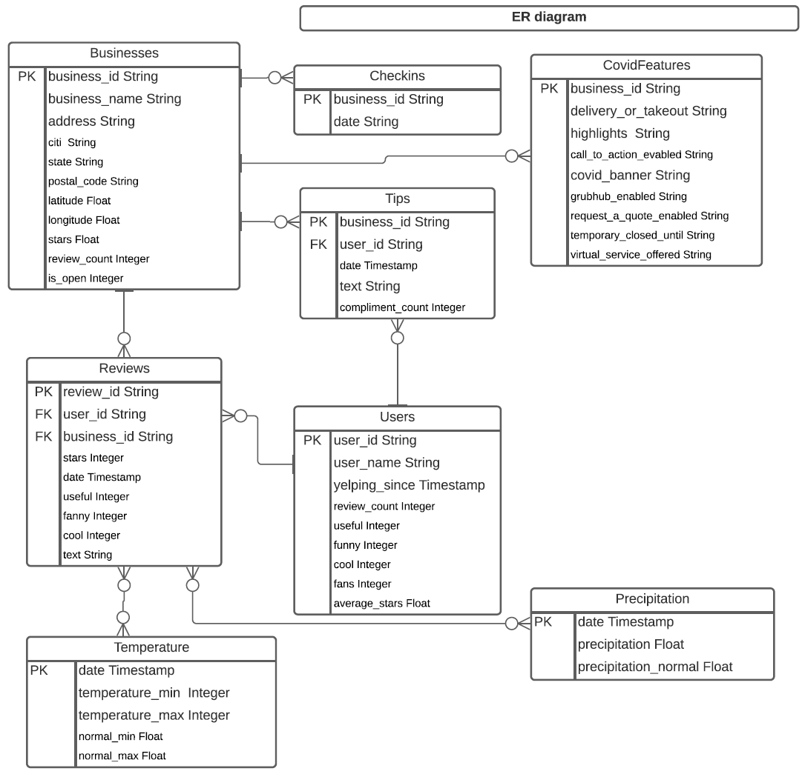
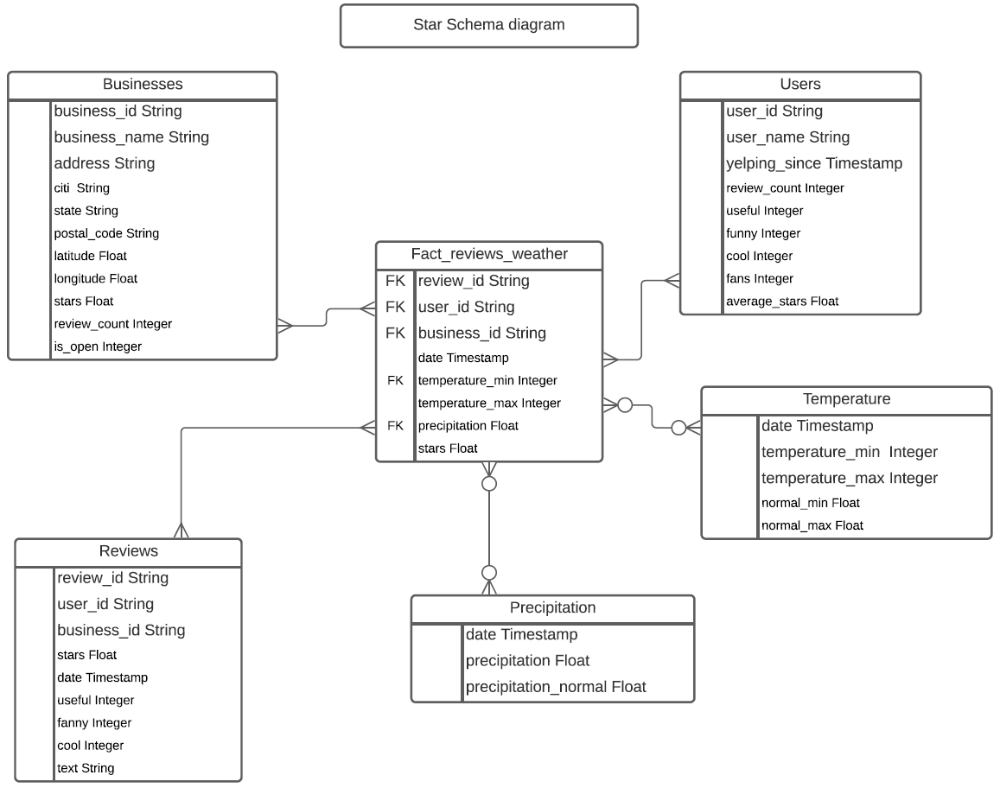

# Cloud Data Warehouse with Snowflake

## Project Overview
In this project, I designed and built end to end data architecture for a cloud based data warehouse with Snowflake.

- evaluated various data assets of an organization and characteristics of these data sources
- designed a staging area for ingesting varieties of data coming from source systems 
- designed an Operational Data Store (ODS)
- designed OLAP dimensional data models
- built ETL from Yelp (restaurants, its reviews and ratings), COVID19 data and Climatic source systems. 
- develop SQL queries to find the impact of weather on restaurant ratings.

## Dataset

https://www.yelp.com/dataset/download https://crt-climate-explorer.nemac.org/

https://www.kaggle.com/datasets/claudiadodge/yelp-academic-data-set-covid-features

•	Data 1: yelp_dataset.tar

•	Data 2: covid_19_dataset.tar

•	Data 3: USC00362574-temperature-degreeFcsv

•	Data 4: USC00362574-EMSWORTH_L_D_OHIO_RIVER-precipitation-inch.csv

Data has been used from Yelp website (list of businesses, restaurants, customer reviews and ratings), climatic source systems (temperature and precipitation data) and COVID19 data. Row counts: business ~209K, users ~2M, check-in ~175K, COVID ~209K, tips ~1.3M, review ~8M, temperature  ~110k, precipitation ~55K.

